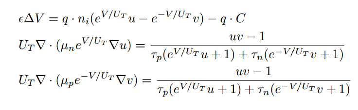
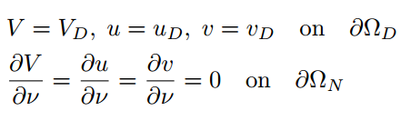
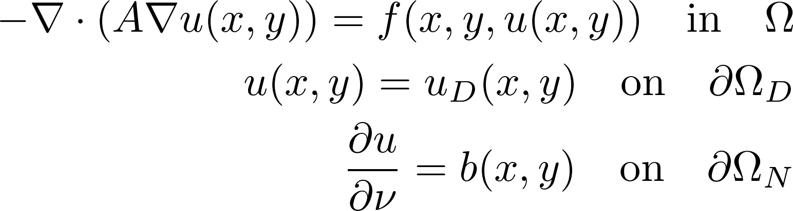
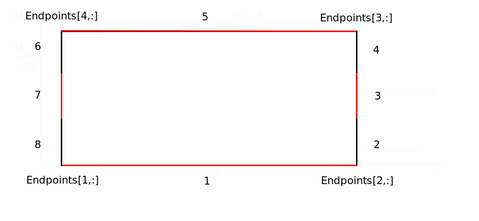
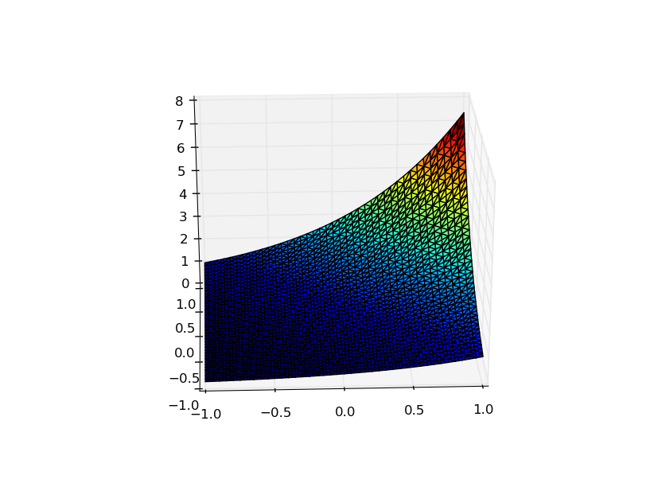
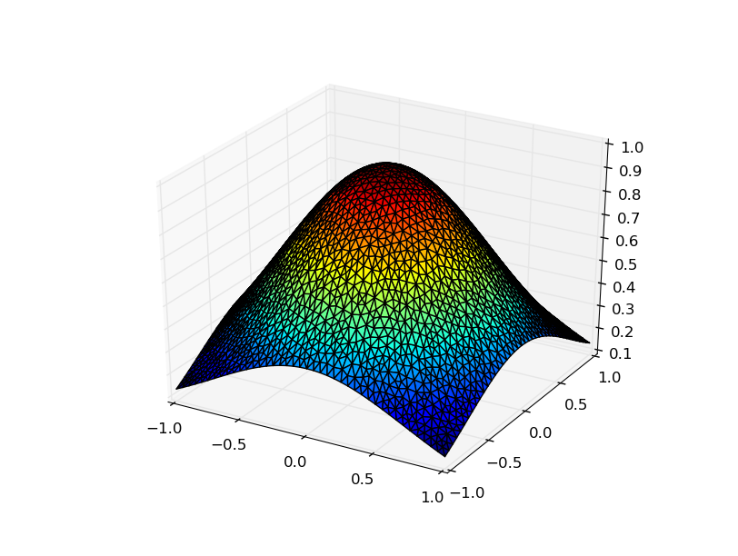

# DriftDiffusionPoissonSystems.jl &mdash; A 2D Finite Element Method Solver for Drift-Diffusion-Poisson Systems and Semilinear Poisson Equations Written in Julia

[](https://travis-ci.org/Stivanification/DriftDiffusionPoissonSystems.jl)

This package provides a numerical solution to drift-diffusion poisson equations in Slotboom variables. The system



is solved for (V,u,v) in a domain $\Omega$, where the boundary is split up into a Neumann part and a Dirichlet part.



It is possible to prescribe
* arbitrary Dirichlet boundary conditions, homogenous Neumann boundary conditions
* arbitrary constants $ \epsilon, U_T, n_i, \tau_p, \tau_n$
* arbitrary functions $\mu_p, \mu_n, C$

The implemented solution method is fixed-point iteration.

# Semilinear Poisson Equations

This package includes a function for solving 2D semilinear poisson equations.



where \Omega is an arbitrary domain and \Omega\_N denote Dirichlet and
Neumann boundary, respectively.In this case, the right hand side function $f$ may depend on the solution $u$.

It is possible to prescribe
* arbitrary Dirchlet and/or Neumann boundary conditions,
* an arbitrary right-hand side function `f` with partial derivative w.r.t solution `g`, and
* a constant coefficient in the elliptic operator.

# Mesh Generation

The user can provide a mesh generated by GMSH (www.gmsh.info) or provide the mesh
information in the composite type `mesh`.
# Functions

## read_mesh

* Input: Path to mesh file.
* Output: Composite type `mesh`.

`read_mesh` reads the GMSH file and creates a composite type `mesh`, which
contains all necessary information about the mesh.

`mesh` contains the following fields:
* `nodes`: 2 &times; nr_nodes array containing the node coordinates
* `edges`: 4 &times; nr_edges array. Lines 1 and 2: nodes forming the
	edge. Line 3: physical property. Line 4: geometrical property
	(defining the boundary condition).
* `elements`: 5 &times; nr_elements array.  Lines 1, 2, and 3: node indices forming the
	triangle. Line 4: physical property. Line 5: geometrical property.

The physical properties are currently not used as well as the
geometrical property of the elements. These quantities may be used to
define subdomains later.

## construct_mesh

* Input: Array `Endpoints`, Array `DirPoints` defining the length/position of the 3- and 7-section in the image below
	mesh-width `h`, meshname `meshname`
* Output: Rectangular .geo file for form indicated below `meshname.geo`

`construct_mesh` creates a rectangular mesh with 8 boundary subdivisions of the form

The 4x2-array `Endpoints` defines the rectangle endpoints, where the first column defines the x-coordinates,
the second column the y-coordinates. One row defines one endpoint, the rows must be entered
in the sequence indicated in the image.
The 2x2-array `DirPoints` defines the boundary sections 3 and 7 in the picture.
The first row defines the y-coordinates of section 7, where Dirpoints[1,1] is the lower (smaller)
y-coordinate, and Dirpoints[1,2] is the upper (greater) y-coordinate, Dirpoints[2,:] should be entered
analogously.

## solve_ddpe

* Input: mesh `mesh`, boundary data `Vbddata`, boundary data `ubddata`, boundary data `vbddata`, constant `epsilon`, constant `U_T`
   constant `n_i`, constant `tau_p`, constant `tau_n`, mobility function `mu_p`, mobility function `mu_n`, charge density function `C`, constant `tol`
* Output: solution arrays `V`, `u`, `v`

`solve_ddpe` takes the input from above and provides the solutions as arrays on the supplied mesh.
The Input needs to be as follows:
* `mesh::mesh`
* all input variables marked as constants must be Float64
* all input variables marked as functions must be functions of two arguments, e.g. `(x,y) -> x+y`
* the boundary data arrays must be 3 &times; n Arrays, where n is the number of different
edge physical properties defined in the GMSH file. The first row needs
to contain the geometrical properties defined in the GMSH file, the second row
contains either `'D'` (for a Dirichlet boundary) or `'N'` (for a Neumann
boundary) at the respective type of edge. The third row contains a function of
two coordinates giving the value of the solution on the boundary, e.g.`(x,y) ->0` for homogeneous conditions.

## solve_semlin_poisson

* Input: mesh `mesh`, ellipticity constant `A`, right-hand side
	function `f`, partial derivative of `f` with respect to u`g`, boundary data `bddata`.
* Output: solution values `u` on the mesh nodes.

solve_semlin_poisson takes the named input and provides the array of solution values at the nodes of the supplied mesh.
The input needs to be as follows:
* `mesh::mesh`.
* `A::Float64`: only constants are allowed.
* `f::Function`: a function of three arguments, e.g. `(x,y,z) -> x+y+z`. The first two arguments are the spatial coordinates,
the third argument is the dependence of `f` on `u`.
* `g::Function`: the partial derivative of the right hand side with respect to the solution as a function of three arguments,
where the third argument is the solution u. E.g. if `f` is of the form `f(x,y,u) = 4*x*y*u^2`, `g` must be entered as
`(x,y,u) -> 8*x*y*u`
* `bddata::Array`: 3 &times; n Array, where n is the number of different
edge physical properties defined in the GMSH file. The first row needs
to contain the geometrical properties defined in the GMSH file, the second row
contains either `'D'` (for a Dirichlet boundary) or `'N'` (for a Neumann
boundary) at the respective type of edge. The third row contains a function of
two coordinates giving the value of the solution on the boundary,
e.g. `(x,y) -> 0` for homogeneous conditions.

# Examples
------------------
The codes and meshes for the following tests are stored in the test folder.

## Drift Diffusion Poisson Equations

### test_meshcreate

This code creates a rectangular mesh `testmesh.msh` with vertices (-1,-1), (1,-1), (1,1), (-1,1).
The `7`-section in this example stretches from (-1, -0.1) to (-1, 0.1), the `3`-section from (1, -0.1) to (1, 0.1).
The mesh-width in this example is 0.05.

```
function test_meshcreate()
	Endpoints = [-1.0 -1.0 ; 1.0 -1.0 ; 1.0 1.0 ; -1.0 1.0]
	Dirpoints = [-0.1 0.1 ; -0.1 0.1]
	h = 0.05
	meshname = "testmesh"
	construct_mesh(Endpoints, Dirpoints, h, meshname)
	run(`gmsh -2 $meshname.geo`)
end
```
The last line compiles the .geo file created by construct_mesh(...) using gmsh.

### test_ddpe1()

Calculates a solution of the drift diffusion poisson equations on the mesh constructed by test_meshcreate(...) with the following parameters:

```
U_T = 1.0
tau_p = 1.0
tau_n = 1.0
mu_p = (x,y) -> 1.0
mu_n = (x,y) -> 1.0
n_i = 1.0
epsilon = 1.6021766*10.0^(-19)
C = (x,y) -> 0
```

The variable `epilson` was chosen such that it cancels out with the elementary charge `q` in the potential equation.
With these variables, the functions `V = c*(x+y), u = exp(-c*(x+y)), v = exp(c*(x+y))` are exact solutions
to the drift diffusion poisson equations for any real constant `c`. In this example, the boundary data was chosen to obtain these solutions:

```
Vbddata = [1 2 3 4 5 6 7 8; 'D' 'D' 'D' 'D' 'D' 'D' 'D' 'D'; (x,y)-> c*(x+y) (x,y)->c*(x+y)	(x,y)->c*(x+y) (x,y)->c*(x+y) (x,y)->c*(x+y) (x,y)->c*(x+y) (x,y)->c*(x+y) (x,y)->c*(x+y);]
ubddata = [1 2 3 4 5 6 7 8; 'D' 'D' 'D' 'D' 'D' 'D' 'D' 'D'; (x,y) ->exp(-c*(x+y)) (x,y) -> exp(-c*(x+y)) (x,y) -> exp(-c*(x+y)) (x,y) -> exp(-c*(x+y)) (x,y) -> exp(-c*(x+y)) (x,y) -> exp(-c*(x+y)) (x,y) -> exp(-c*(x+y)) (x,y) -> exp(-c*(x+y));]
vbddata = [1 2 3 4 5 6 7 8; 'D' 'D' 'D' 'D' 'D' 'D' 'D' 'D'; (x,y) ->exp(c*(x+y)) (x,y) -> exp(c*(x+y)) (x,y) -> exp(c*(x+y)) (x,y) -> exp(c*(x+y)) (x,y) -> exp(c*(x+y)) (x,y) -> exp(c*(x+y)) (x,y) -> exp(c*(x+y)) (x,y) -> exp(c*(x+y));]
```
The remaining section of the code

```
xcoord=zeros(size(mesh.nodes,2),1)
ycoord=zeros(size(mesh.nodes,2),1)
for i=1:size(mesh.nodes,2)
	xcoord[i]=mesh.nodes[1,i]
	ycoord[i]=mesh.nodes[2,i]
end

f = (x,y) -> exp(c*(x+y))
surf(vec(xcoord),vec(ycoord),vec(v),cmap="jet")
exacterror = maximum(abs(vec(v) - f(xcoord,ycoord)))
println("maximum error: $exacterror")
```
plots the solution `v` and prints the exact error value for `v`.



## Semilinear Poisson Equations

The equation in this example is the nonlinear Poisson-Boltzmann equation, i.e.

```
$ - \Delta u + \sinh(u) = h $

$ u = u_D on \partial\Omega_D$

$ u = b on \partial\Omega_N$
```
We choose $h = 4\exp(-x^2-y^2)\cdot(1-x^2-y^2) + \sinh(\exp(-x^2-y^2))$ to obtain the exact solution $u =\exp(-x^2-y^2)$.  
The function `f` for this example should then be set to $f(x,y,u) = 4\exp(-x^2-y^2)\cdot(1-x^2-y^2) + \sinh(\exp(-x^2-y^2)) - \sinh(u)$.

First, the mesh file, right hand side function `f` and its partial derivative w.r.t. u `g` as well as the boundary data need to be prescribed:
```
mesh = read_mesh("mesh_s_p05.msh")
f = (x,y,u) -> 4*exp(-x.^2 -y.^2).*(1 - x.^2 - y.^2) + sinh(exp(-x.^2-y.^2)) - sinh(u)
g = (x,y,u) -> -cosh(u)
A = [(x) -> 1;(x)->0;(x)->0;(x)->1]    		
bddata=[1 2 3 4;'D' 'N' 'D' 'N';(x,y)->exp(-x.^2-y.^2)  (x,y)->-2x.*exp(-x.^2-y.^2) (x,y)-> exp(-x.^2-y.^2) (x,y)->2x.*exp(-x.^2-y.^2)]
```
The solution is then obtained using
```
u=solve_semlin_poisson(mesh,A,bddata,f,g)
```
The remaining code section compares the obtained solution to the exact solution, calculates and prints the maximal error value and plots the solution:

```
xcoord=zeros(size(mesh.nodes,2),1)
ycoord=zeros(size(mesh.nodes,2),1)
for i=1:size(mesh.nodes,2)
	xcoord[i]=mesh.nodes[1,i]
	ycoord[i]=mesh.nodes[2,i]
end
    exakt = vec(exp(-xcoord.^2 -ycoord.^2))
    versuch = maximum(abs(vec(u)-exakt))
	println("error maximum:$versuch")
	surf(vec(xcoord),vec(ycoord),vec(u),cmap="jet")
```


# Authors
---------

* Caroline Geiersbach
* Clemens Heitzinger (Clemens.Heitzinger@TUWien.ac.at, http://Clemens.Heitzinger.name)
* Gerhard Tulzer (Gerhard.Tulzer@TUWien.ac.at)
* Gudmund Pammer (gudmund.pammer@tuwien.ac.at)
* Stefan Rigger (stefan.rigger@tuwien.ac.at)
